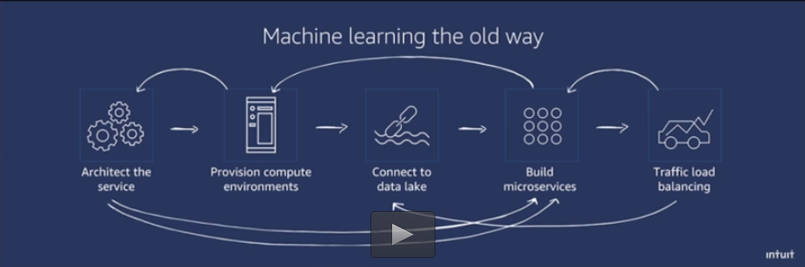
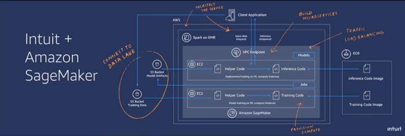

## AWS

## Table of contents:

- [Intro to AWS](#aws)
- [Awesome AWS](https://github.com/donnemartin/awesome-aws)
- [How to start with Amazon Web Service Command Line - First lesson CloudAcademy.com](https://www.youtube.com/watch?v=FwbavIglhis)
- [Serverless](#serverless)
- [SAM](#sam)

## AWS
https://github.com/aws
https://github.com/awslabs
https://github.com/aws-samples

## Serverless

https://www.slideshare.net/AmazonWebServices/building-a-development-workflow-for-serverless-applications-march-2017-aws-online-tech-talks

https://serverless.com/framework/docs/

https://serverless.com/blog/serverless-github-webhook-slack/

https://github.com/serverless/examples

https://kalinchernev.github.io/serverless-github-bot-aws-lambda-api-gateway-nodejs/

[Dev](https://serverless-stack.com/)
https://github.com/AnomalyInnovations/serverless-stack-com

## SAM

- [SAM CLI](https://github.com/awslabs/aws-sam-cli)

- [SAM](https://github.com/awslabs/serverless-application-model)

- [SAM workshops](https://github.com/aws-samples/aws-serverless-workshops)

- [Serverless Bytes | Workshop on Building a Serverless App](https://www.youtube.com/watch?v=Hv3YrP8G4ag)

## AWS DynamoDB

## AWS Lex Bot

*  Example Bot: ScheduleAppointment https://docs.aws.amazon.com/lex/latest/dg/ex1-sch-appt.html

### AWS Alexa

* https://github.com/alexa/alexa-cookbook

### AWS SageMaker

[How Intuit Uses Amazon SageMaker to Manage Machine Learning at Scale, AWS San Francisco Summit 2018](https://aws.amazon.com/solutions/case-studies/Intuit/?hp=tile&story=intuit)

**Development time went down by 90% with Amazone SageMaker   6 months to less than 1 week.**

## Workshops AWS

https://github.com/aws-samples/aws-serverless-workshops

[Building Next-Gen Cloud-Based Apps: Workshops on Cloud, Serverless, and Container Orchestration](https://gotochgo.com/2018/workshops/88)

**Build a Serverless Web Application in One Day**

In this workshop you'll learn to build a web application using a serverless architecture. With fresh funding from its seed investors, **Wild Rydes** is seeking to build the world’s greatest mobile/VR/AR unicorn transportation system. The scrappy startup needs a first-class webpage to begin marketing to new users and to begin its plans for global domination. Join us to help Wild Rydes build a website using a serverless architecture. You’ll build a scalable website using services like AWS Lambda, Amazon API Gateway, Amazon DynamoDB, Amazon Cognito, and Amazon S3.

http://www.wildrydes.com/ https://www.fivetalent.com/saddling-aws-wild-rydes-workshop/

https://codeburst.io/tutorial-for-building-a-web-application-with-amazon-s3-lambda-dynamodb-and-api-gateway-6d3ddf77f15a   https://github.com/aws-samples/aws-serverless-workshops/tree/master/WebApplication

https://www.slideshare.net/AmazonWebServices/getting-started-with-aws-lambda-and-serverless-computing-79032206

https://www.diycode.cc/projects/awslabs/aws-serverless-website-workshop

[Build a Serverless Web Application on AWS Cloud- Part1](https://www.youtube.com/watch?v=n5XFPLo4Bbw) https://github.com/vnathv/serverless-webapp

**Serverless Data Processing on AWS**

**Wild Rydes** the world’s leading unicorn transportation startup, needs your help! In this workshop, we’ll build infrastructure to enable operations personnel at Wild Rydes headquarters to monitor the health and status of their unicorn fleet. Each unicorn is equipped with a sensor that reports its location and vital signs. During this workshop we’ll use AWS to build applications to process and visualize this data in real-time.

We will use a variety of AWS services including: Amazon Kinesis, AWS Lambda, Amazon S3, Amazon DynamoDB, Amazon Cognito, and Amazon Athena. We’ll use Lambda to process real-time streams, DynamoDB to persist unicorn vitals, Amazon Kinesis Data Analytics to build a serverless application to aggregate data, Amazon Kinesis Data Firehose to archive the raw data to Amazon S3, and Athena to run ad-hoc queries against the raw data.

## Workshops
**Web Application**  This workshop shows you how to build a dynamic, serverless web application. You'll learn how to host static web resources with Amazon S3, how to use Amazon Cognito to manage users and authentication, and how to build a RESTful API for backend processing using Amazon API Gateway, AWS Lambda and Amazon DynamoDB.

**Data Processing**  This workshop demonstrates how to collect, store, and process data with a serverless application. In this workshop you'll learn how to automatically process files on Amazon S3 using AWS Lambda, how to build real-time streaming applications using Amazon Kinesis Streams and Amazon Kinesis Analytics, how to archive data streams using Amazon Kinesis Firehose and Amazon S3, and how to run ad-hoc queries on those files using Amazon Athena.

**DevOps**  This workshop shows you how to use the Serverless Application Model (SAM) to build a serverless application using Amazon API Gateway, AWS Lambda, and Amazon DynamoDB. You'll learn how to use SAM from your workstation to release updates to your application, how to build a CI/CD pipeline for your serverless application using AWS CodePipeline and AWS CodeBuild, and how to enhance your pipeline to manage multiple environments for your application.

**Image Processing** - This module shows you how to build a serverless image processing application using workflow orchestration in the backend. You'll learn the basics of using AWS Step Functions to orchestrate multiple AWS Lambda functions while leveraging the deep learning-based facial recognition features of Amazon Rekogntion.

**Multi Region** - This workshop shows you how to build a serverless ticketing system that is replicated across two regions and provides automatic failover in the event of a disaster. You will learn the basics of deploying AWS Lambda functions, exposing them via API Gateway, and configuring replication using Route53 and DynamoDB streams.

[serverless-golang-api-with-aws-lambda](https://read.acloud.guru/serverless-golang-api-with-aws-lambda-34e442385a6a)

https://cloudncode.blog/2017/06/13/serverless-ci-part-1-getting-started-with-aws-codebuild/
https://cloudncode.blog/2017/08/01/serverless-ci-part-2-getting-started-with-aws-codepipeline/

## Reference Books and Research Papers:

**Serverless Architectures on AWS With examples using AWS Lambda** by Peter Sbarski https://www.manning.com/books/serverless-architectures-on-aws?a_aid=serverless-architectures-on-aws&a_bid=145280de https://github.com/sbarski/serverless-architectures-aws
