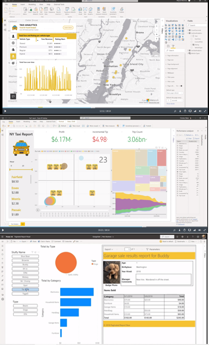

# Power BI

Power BI is a business analytics solution that lets you visualize your data and share insights across your organization, or embed them in your app or website. Connect to hundreds of data sources and bring your data to life with live dashboards and reports.

https://powerbi.microsoft.com/en-ie/

[Taxi Analyitcs](https://mybuild.microsoft.com/sessions/a8ee3d06-07a7-426c-8eae-6f16a7ad4cb7?source=sessions)

https://docs.microsoft.com/en-us/power-bi/guidance/star-schema

[Trends](https://trends.google.com/trends/explore?date=all&q=%2Fm%2F02s9k80,Qlik%20%2B%20QlikView%20%2B%20QlikSense,Power%20BI)

**Pro Power BI Desktop** by Adam Aspin, 3rd ed 2020

https://github.com/gdeckler/LearnPowerBI

https://github.com/NajiElKotob/Awesome-Power-BI
