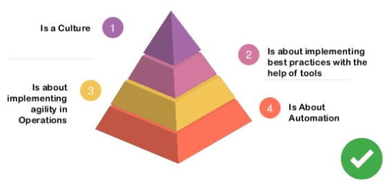
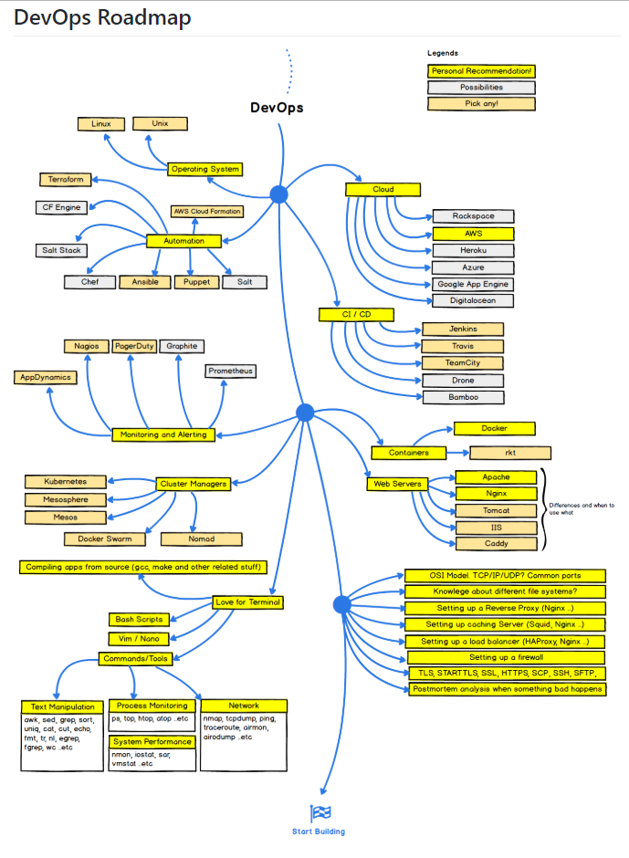

# DevOps

DevOps is the practice of operations and development engineers participating together in the entire service lifecycle, from design through the development process to production support.

https://theagileadmin.com/what-is-devops/

DevOps is the combination of cultural philosophies, practices, and tools that increases an organization's ability to deliver applications and services at high velocity: evolving and improving products at a faster pace than organizations using traditional software development and infrastructure management processes.

https://aws.amazon.com/devops/what-is-devops/

https://www.slideshare.net/gauravslide/transform-agile-development-with-practical-devops-86846081

DevOPS:

* Code
* Build
* Integrate
* Test
* Package
* Release
* Deploy
* Operate

