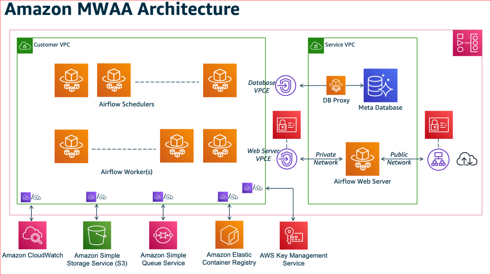
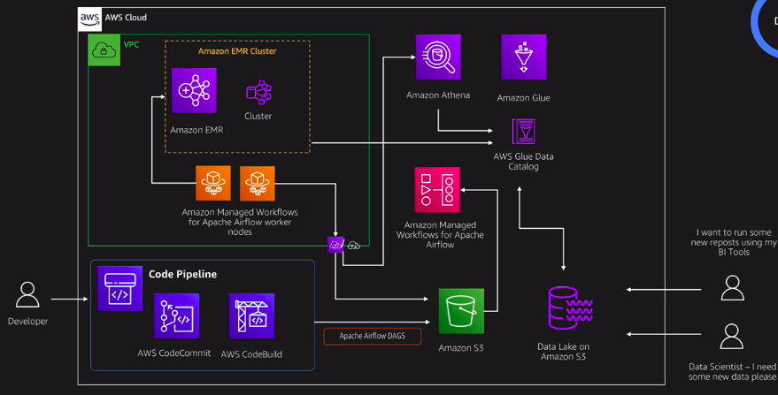

# Amazon Managed Workflows for Apache Airflow

Managed Workflows for Apache Airflow (Amazon MWAA) is a managed service for open source Apache Airflow, to programmatically author, schedule, and monitor workflows.

[Amazon Managed Workflows for Apache Airflow](https://aws.amazon.com/managed-workflows-for-apache-airflow/) [tutorial](https://docs.aws.amazon.com/mwaa/latest/userguide/quick-start.html)

With Amazon MWAA, you can **focus on business logic and build workflows** without worrying about the management responsibilities such as

**setup, patching, upgrades, security, scaling**.

## Resources

https://amazon-mwaa-for-analytics.workshop.aws/

https://github.com/aws-samples/amazon-mwaa-examples

https://github.com/aws-samples/amazon-mwaa-automating-dag-deployment
