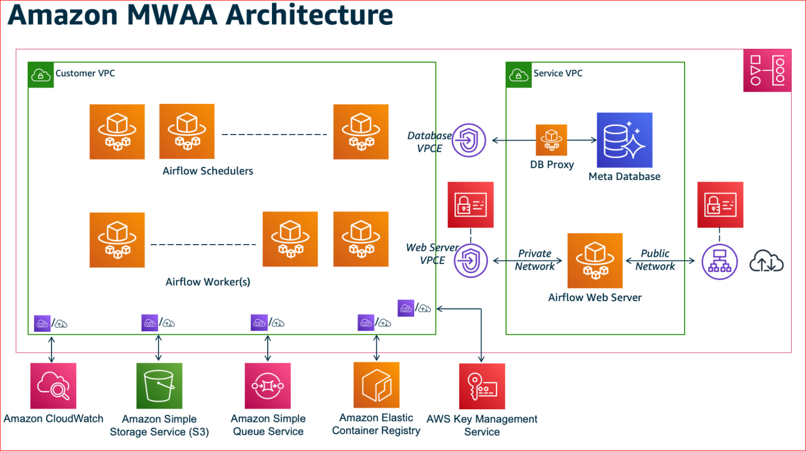
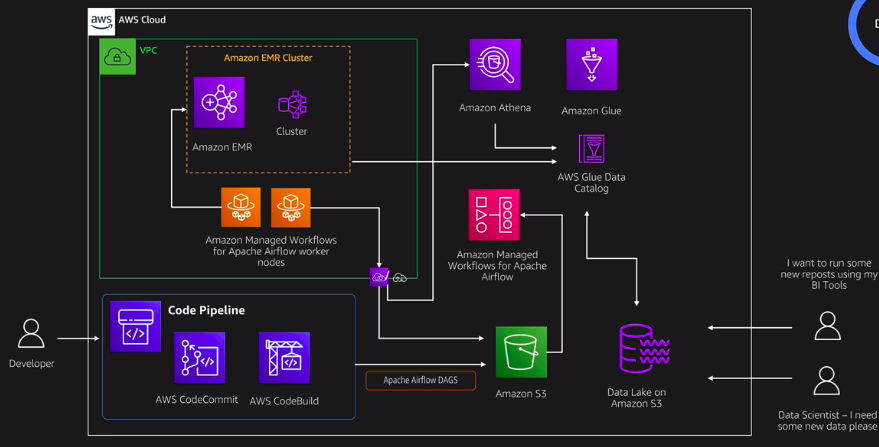
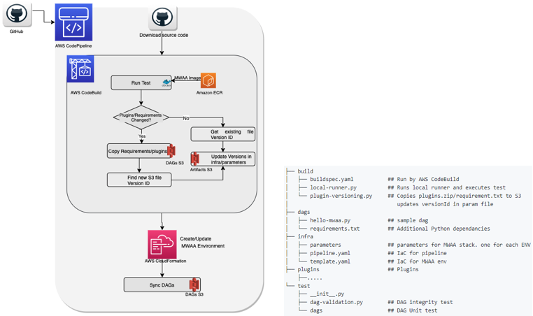

# Amazon Managed Workflows for Apache Airflow

Managed Workflows for Apache Airflow (Amazon MWAA) is a managed service for open source Apache Airflow, to programmatically author, schedule, and monitor workflows.

[Amazon Managed Workflows for Apache Airflow](https://aws.amazon.com/managed-workflows-for-apache-airflow/) [tutorial](https://docs.aws.amazon.com/mwaa/latest/userguide/quick-start.html)

 With Amazon MWAA, you can **focus on business logic and build workflows** without worrying about the management responsibilities such as

  **setup, patching, upgrades, security, scaling**.

  Amazon MWAA takes away the operational responsibility so you can focus on building workflows.

  Adopting CI/CD and the best practices from the Operational Excellence pillar can help address risks in an environment, and limit errors from manual processes.

Build an automated CI/CD pipeline to accelerate deploying workflows, and we described how to automate tasks, including updates to plugins and requirements files. You can deploy the CI/CD pipeline and related code to your own AWS account using instructions found in the GitHub repository.

https://github.com/aws-samples/amazon-mwaa-automating-dag-deployment

https://aws.amazon.com/blogs/opensource/automating-a-dag-deployment-with-amazon-managed-workflows-for-apache-airflow

Automate deploying workflows (Directed Acyclic Graphs, or DAGs) to an Amazon MWAA environment.

 First, we explore how to **sanity-test DAGs, identify issues with dependencies, and apply unit tests** so that you get feedback on workflows **quickly** and avoid unnecessary deployments.

  Second, we explore how to **create and update the MWAA environment** through **infrastructure as code (IaC)** as changes are detected.

## Resources

  https://amazon-mwaa-for-analytics.workshop.aws/

  https://github.com/aws-samples/amazon-mwaa-examples
