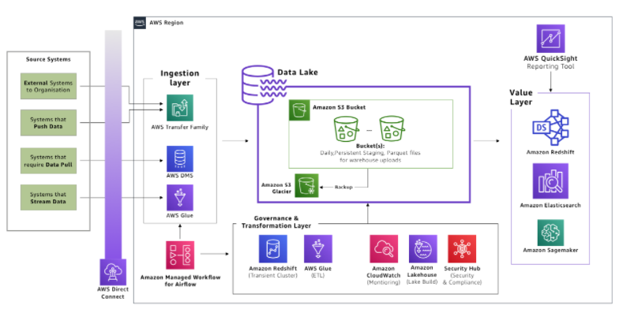

# Lake House architecture

A Lake House architecture approach integrates a data lake, a data warehouse, and purpose-built stores, enabling unified governance and easy data movement.

With a Lake House architecture, customers can store data in a data lake and use a ring of purpose-built data services around the lake allowing them to make decisions with speed and agility, at a scale and price/performance that is unmatched in the market.

https://aws.amazon.com/blogs/architecture/benefits-of-modernizing-on-premise-analytics-with-an-aws-lake-house/

https://d1.awsstatic.com/whitepapers/derive-insights-from-aws-lake-house.pdf
