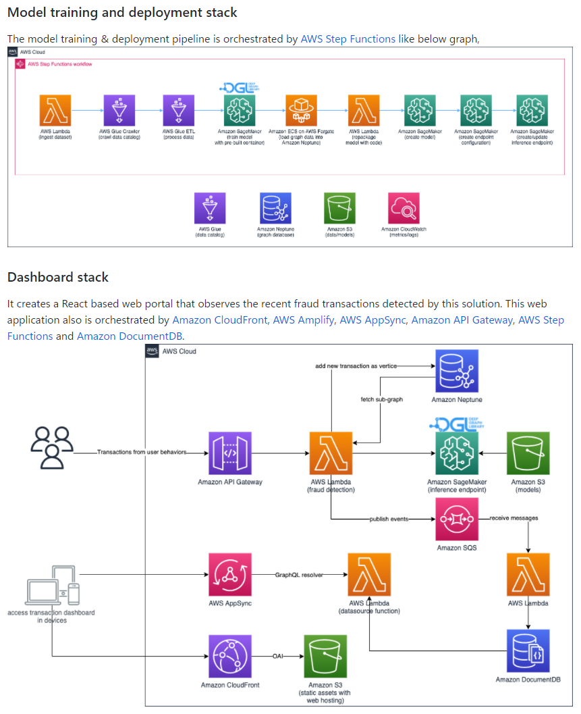

# Amazon Neptune

Amazon Neptune is a fast, reliable, fully-managed graph database service that makes it easy to build and run applications that work with highly connected datasets. Use cases are : identity graphs, knowledge graphs, and fraud detection.

https://aws.amazon.com/neptune/ https://www.amazonaws.cn/en/neptune/

Neptune can support a scalable, high-performance graph database, which is a type of NoSQL database that can store, map and query relationships between data sets.

Amazon Neptune simplifies the process for a developer to write queries that can search connected data points with low latency. Neptune supports graph models, such as World Wide Web Consortium's (W3C) Resource Description Framework (RDF) and Property Graph, along with their respective query languages, SPARQL and Apache TinkerPop Gremlin.

Amazon Neptune is highly available, with read replicas, point-in-time recovery, continuous backup to Amazon S3, and replication across Availability Zones. Neptune is secure with support for HTTPS encrypted client connections and encryption at rest. Neptune is fully managed, so you no longer need to worry about database management tasks such as hardware provisioning, software patching, setup, configuration, or backups.

## Solutions

https://github.com/awslabs/realtime-fraud-detection-with-gnn-on-dgl

https://awslabs.github.io/realtime-fraud-detection-with-gnn-on-dgl/en/

An end-to-end solution for real-time fraud detection(leveraging graph database Amazon Neptune) using Amazon SageMaker and Deep Graph Library (DGL) to construct a heterogeneous graph from tabular data and train a Graph Neural Network(GNN) model to detect fraudulent transactions in the IEEE-CIS dataset.

