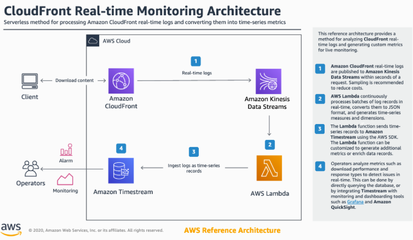

# Amazon Timestream

[Amazon Timestream](https://aws.amazon.com/timestream/) is a fast, scalable, fully managed, purpose-built time series database that makes it easy to store and
 analyze trillions of time series data points per day. It is used majorly for IoT applications and 1000 times faster with 1/10th cost of relational databases. Using its purpose-built query engine, you can query recent data and historical stored data simultaneously. It provides multiple built-in functions to analyze time-series data to find useful insights.

Amazon Timestream features:

* No servers to manage or instances to provision; everything is handled automatically.
* Cost-effective, pay only for what you ingest, store, and query.
* Capable of ingesting trillions of events daily with no drop in performance
* Built-in analytics capability with standard SQL, interpolation, and smoothing functions to identify trends, patterns, and anomalies
* All the data is encrypted using the AWS key management system (KMS) with customer manages keys (CMK)


* [Analyzing time series data with Amazon SageMaker Notebooks](https://github.com/awslabs/amazon-
* [Writing and Querying with Pandas (AWS Data Wrangler)](https://github.com/awslabs/amazon-timestream-tools/blob/master/integrations/pandas/)

https://github.com/awslabs/amazon-timestream-tools/tree/master/sample_apps/python

https://docs.aws.amazon.com/timestream/latest/developerguide/what-is-timestream.html

# Getting started with Amazon Timestream with Python

This sample application shows how you can create a database and table, populate the table with ~126K rows of sample data, and run sample queries to jumpstart your evaluation and/or proof-of-concept applications with Amazon Timestream.

----

## Dependencies
- Boto3
- Python3

## How to use it

0. (Optional) You can work within a virtual environment
    ```
    python3 -m venv venv
    . venv/bin/activate
    ```

1. Install and configure Boto3 set up following the instructions at https://boto3.amazonaws.com/v1/documentation/api/latest/index.html or executing the following command:
	```
	pip3 install -r requirements.txt --upgrade
	```

1. Run the following commands to insert data into Timestream and to query the data
    ```
    python3 SampleApplication.py --csv_file_path ../data/sample.csv --kmsId ${kmsId}
    ```

    Both --kmsId and --csv_file_path are optional parameters.

    UpdateDatabase API will be called if the kmsId is provided. This kmsId should refer to a valid kms key present in your account. If the kmsId is not provided, UpdateDatabase will not be called.

    Provide a csv file to perform data ingestion.
    
    
## Solutions

https://www.sufle.io/blog/data-visualization-with-amazon-timestream-and-grafana

https://github.com/aws-samples/aws-cloudfront-realtime-monitoring


