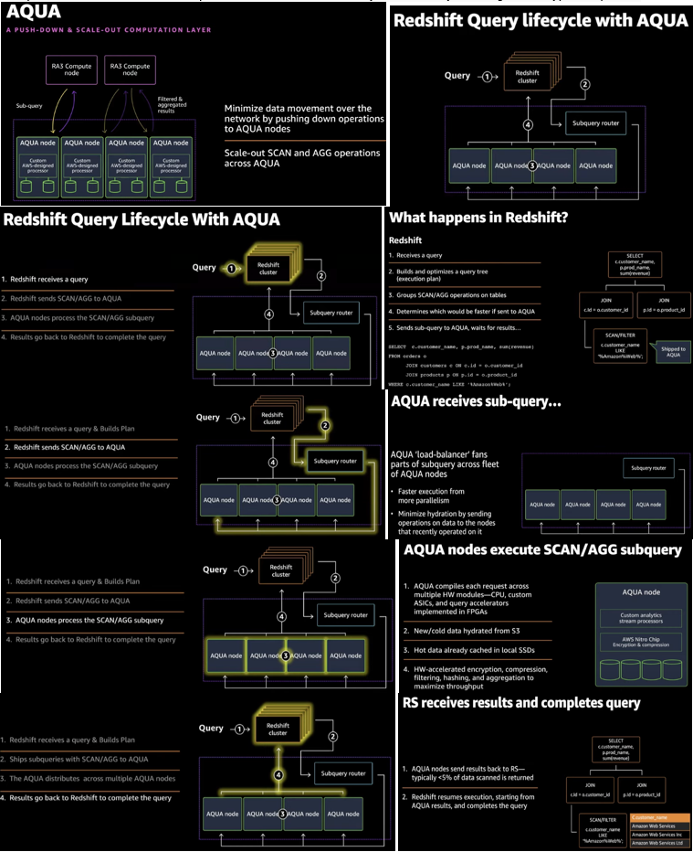

# AQUA (Advanced Query Accelerator) for Amazon Redshift

 AQUA is a new distributed and hardware-accelerated cache that enables Redshift to run up to 10x faster than other enterprise cloud data warehouses by automatically boosting certain types of queries.

 AQUA uses high speed solid state storage, field-programmable gate arrays (FPGAs) and AWS Nitro to speed queries that scan, filter, and aggregate large data sets. AQUA is included with the Redshift **RA3 instance** type at no additional cost.

 AQUA (Advanced Query Accelerator) is an analytics query accelerator for Amazon Redshift that uses custom-designed hardware to speed up queries that scan large datasets.

 AQUA is a cost-effective addition to Amazon Redshift–managed storage that is optimized for secure, transactional, multitenant access and high-throughput analytic queries. It uses high speed Non-Volatile Memory Express (NVMe) solid-state storage elements and Nitro-based acceleration for compression and encryption. It uses acceleration based on a field-programmable gate array (FPGA) to push as much computation as possible into the storage layer. These components are connected together in a unique way, allowing data scanning without using a traditional CPU. At the same time, these components allow intermediate results to be aggregated in high-speed memory. AQUA is a data cache and maintains high-speed connections to Redshift managed storage.

 You don't need to change your databases or applications to use AQUA. Amazon Redshift identifies the scan portions of queries that can benefit from acceleration and push them to AQUA for processing. AQUA automatically optimizes query performance on subsets of the data that require extensive scans, filters, and aggregation. With this approach, you can use AQUA to run queries that scan, filter, and aggregate large datasets. AQUA excels at queries that require processing-intensive scans, filters, and aggregation such as those that contain LIKE and SIMILAR TO predicates.

 AQUA supports authentication, encryption, isolation, and compliance to keep your data at rest and data in transit secure.

AQUA is available on clusters with ra3.16xlarge and ra3.4xlarge node types.

 

AQUA for Redshift Jun 15, 2021 https://www.youtube.com/watch?v=EOwg8NwZKkI&t=2202s

https://aws.amazon.com/blogs/aws/new-aqua-advanced-query-accelerator-for-amazon-redshift/

https://aws.amazon.com/blogs/big-data/use-aqua-with-amazon-redshift-ra3-xlplus-nodes

https://docs.aws.amazon.com/redshift/latest/mgmt/managing-cluster-aqua-understanding.html  
