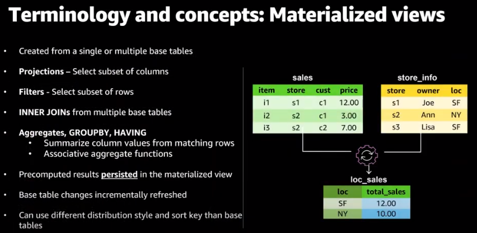

# Materialized Views

**Materialized views:**

A materialized view contains a precomputed result set, based on an SQL query over one or more base tables.

Materialized views are especially useful for speeding up queries that are predictable and repeated.

With support for materialized views, Amazon Redshift provides significantly faster query performance for predictable and repeated workloads such as ELT data processing and BI dashboards.

You can use materialized views to easily store and manage pre-computed results of a SELECT statement that may reference one or more tables, including external tables. Subsequent queries referencing the materialized views can run much faster by reusing the pre-computed results. Amazon Redshift can efficiently maintain the materialized views incrementally to continue to provide the low latency performance benefits.

https://docs.aws.amazon.com/redshift/latest/dg/materialized-view-overview.html

https://docs.aws.amazon.com/redshift/latest/dg/materialized-view-create-sql-command.html
