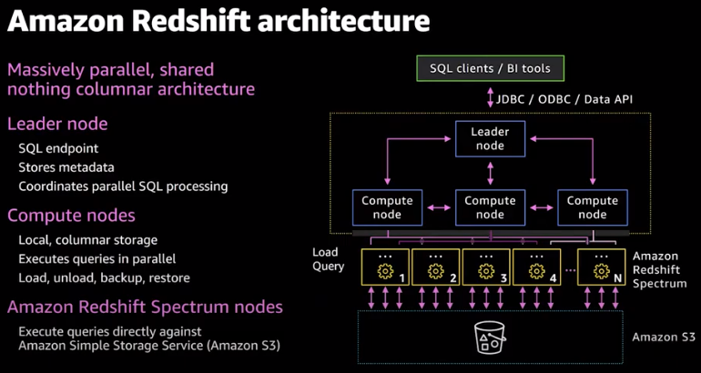
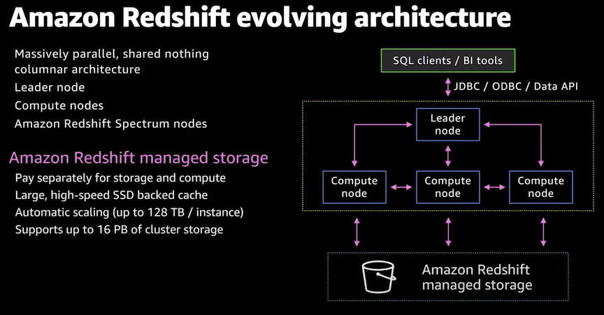
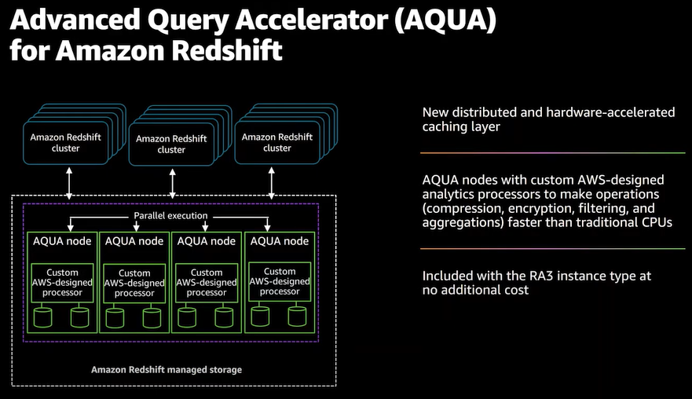
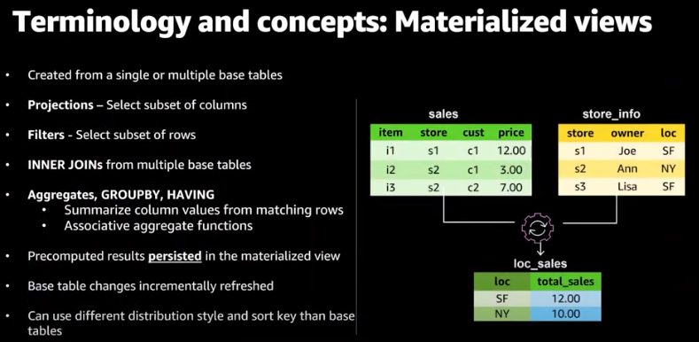
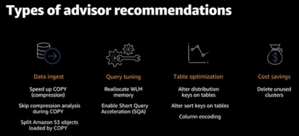
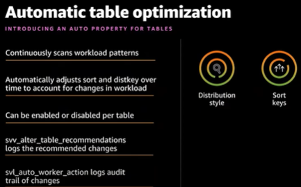
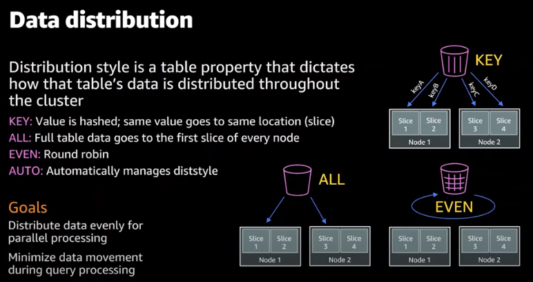

# Amazon Redshift

Amazon Redshift is a fully managed, fast, petabyte-scale data warehouse service that is cost-effective and provides a simple way to efficiently analyze your data using your existing business intelligence tools.

Amazon Redshift costs less than a tenth of most traditional data warehousing solutions and is optimized for datasets ranging from a few hundred gigabytes to petabytes.

**Redshift Cluster:** Redshift uses a cluster of nodes as its core infrastructure component. A cluster usually has one leader node and several compute nodes. In cases where there is only one compute node, there is no additional leader node.

 **Compute Nodes:** Each compute node has its own CPU, memory and storage disk. Client applications are oblivious to the existence of compute nodes and never have to deal directly with compute nodes.

**Leader Node:** The leader node is responsible for all communications with client applications. The leader node also manages the coordination of compute nodes. Query parsing and execution plan development is also the responsibility of the leader node. On receiving a query, the leader node creates the execution plan and assigns the compiled code to compute nodes. A portion of the data is assigned to each compute node. The final aggregation of the results is performed by the leader node.

 ## Features:
### Massively Parallel
Amazon Redshift delivers fast query performance on datasets ranging in size from gigabytes to exabytes. Redshift uses columnar storage, data compression, and zone maps to reduce the amount of I/O needed to perform queries. It uses massively parallel processing (MPP) data warehouse architecture to parallelize and distribute SQL operations to take advantage of all available resources. The underlying hardware is designed for high-performance data processing, using locally attached storage to maximize throughput between the CPUs and drives, and a high bandwidth mesh network to maximize throughput between nodes.

### Fault-Tolerant
Amazon Redshift has multiple features that enhance the reliability of your data warehouse cluster. Redshift continuously monitors the health of the cluster, and automatically re-replicates data from failed drives and replaces nodes as necessary for fault tolerance.

**AQUA (Advanced Query Accelerator) for Amazon Redshift:** AQUA is a new distributed and hardware-accelerated cache that enables Redshift to run up to 10x faster than other enterprise cloud data warehouses by automatically boosting certain types of queries. AQUA uses high speed solid state storage, field-programmable gate arrays (FPGAs) and AWS Nitro to speed queries that scan, filter, and aggregate large data sets. AQUA is included with the Redshift RA3 instance type at no additional cost.

**Materialized views:** Amazon Redshift materialized views allow you to achieve significantly faster query performance for iterative or predictable analytical workloads such as dashboarding, and queries from Business Intelligence (BI) tools, and Extract, Load, Transform (ELT) data processing jobs. You can use materialized views to easily store and manage pre-computed results of a SELECT statement that may reference one or more tables, including external tables. Subsequent queries referencing the materialized views can run much faster by reusing the pre-computed results. Amazon Redshift can efficiently maintain the materialized views incrementally to continue to provide the low latency performance benefits.

**Flexible Querying:** Amazon Redshift gives you the flexibility to execute queries within the console or connect SQL client tools, libraries, or Business Intelligence tools you use. Query Editor on the AWS console provides a powerful interface for executing SQL queries on Redshift clusters and viewing the query results and query execution plan (for queries executed on compute nodes) adjacent to your queries.

Amazon Redshift **RSQL** is a command line client for interacting with Amazon Redshift clusters and databases. With Amazon Redshift RSQL, you connect to an Amazon Redshift cluster, describe database objects, query data, and view query results in various output formats.  https://docs.aws.amazon.com/redshift/latest/mgmt/rsql-query-tool.html

https://aws.amazon.com/about-aws/whats-new/2021/09/amazon-redshift-rsql-amazon-redshift-clusters-databases/

**Federated Query:** With the new federated query capability in Redshift, you can reach into your operational, relational database.
Query live data across one or more Amazon RDS and Aurora PostgreSQL and in preview RDS MySQL and Aurora MySQL databases to get instant visibility
into the end-to-end business operations without requiring data movement.

**Data Sharing** A secure and easy way to share data across amazon redshift clusters.

** Amazon Redshift Data API** 
Using Amazon Redshift Data API, you can access Amazon Redshift data with web services–based applications, including AWS Lambda, Amazon SageMaker notebooks, and AWS Cloud9.

 The **SUPER data type** is an Amazon Redshift data type that enables the storage of schemaless arrays and structures that contain Amazon Redshift scalars and possibly nested arrays and structures. Use the SUPER data type to store semistructured data or documents as values.
 
 With the SUPER data type and the PartiQL language, Amazon Redshift expands data warehouse capabilities to natively ingest, store, transform, and analyze semi-structured data.
 
 https://docs.aws.amazon.com/redshift/latest/dg/super-overview.html https://aws.amazon.com/blogs/big-data/work-with-semistructured-data-using-amazon-redshift-super/

**Redshift partner console integration (preview):** You can accelerate data onboarding and create valuable business insights in minutes by integrating with select partner solutions in the Redshift console. With these solutions you can bring data from applications like Salesforce, Google Analytics, Facebook Ads, Slack, Jira, Splunk, and Marketo into your Amazon Redshift data warehouse in an efficient and streamlined way. It also enables you to join these disparate datasets and analyze them together to produce actionable insights.

**Amazon Redshift uses machine learning** to deliver high throughout, irrespective of workloads or concurrent usage. It utilizes sophisticated algorithms to predict incoming query run times and assigns them to the optimal queue for the fastest processing. For instance, queries such as dashboards and reports with high concurrency requirements are routed to an express queue for immediate processing.

**Amazon Redshift Advisor** offers recommendations about how to optimize your Amazon Redshift cluster to increase performance and save on operating costs.

 

## Resources

https://docs.aws.amazon.com/redshift/latest/gsg/getting-started.html

https://docs.aws.amazon.com/redshift/latest/dg/c_high_level_system_architecture.html

https://github.com/aws-quickstart/quickstart-amazon-redshift

https://github.com/awslabs/amazon-redshift-utils

https://github.com/awslabs/amazon-redshift-monitoring

https://aws.amazon.com/redshift/features/

https://github.com/awsdocs/amazon-redshift-management-guide/tree/master/doc_source

https://aws.amazon.com/blogs/aws/new-aqua-advanced-query-accelerator-for-amazon-redshift/

## Books

Amazon Redshift Cookbook

Amazon Redshift A Complete Guide by Gerardus Blokdyk
