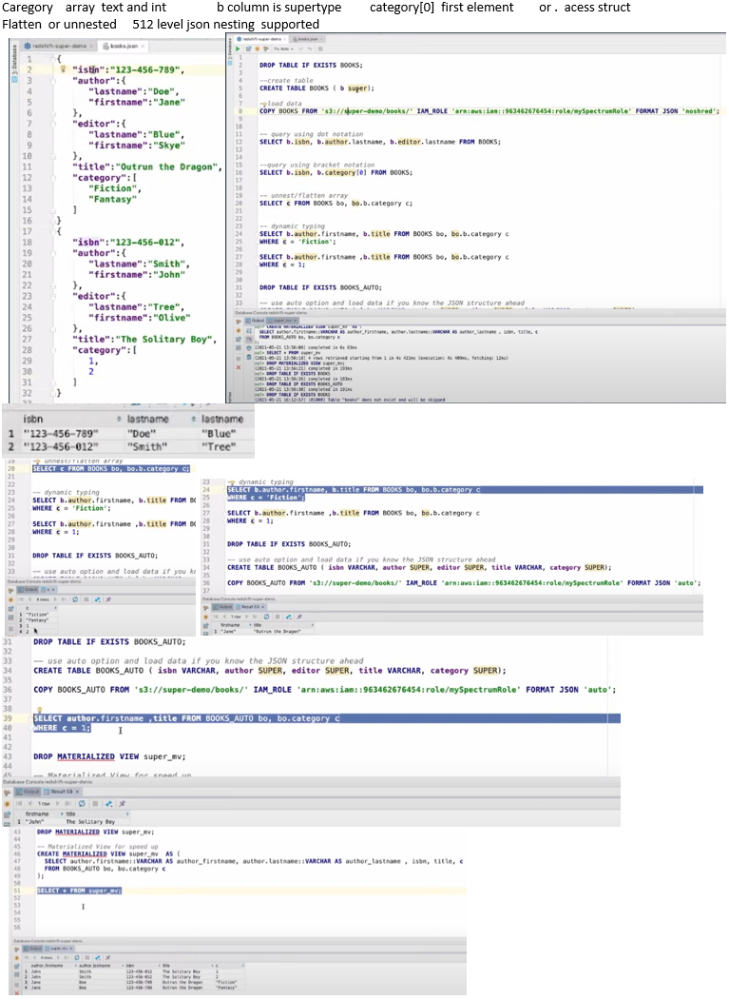

# Amazon Redshift Super datatype

Amazon Redshift Super datatype, a generic datatype within redshift that enables use of document/object formats, reducing pre/post processing needs.

The SUPER data type is an Amazon Redshift data type that enables the storage of schemaless arrays and structures that contain Amazon Redshift scalars and possibly nested arrays and structures. Use the SUPER data type to store semistructured data or documents as values.

With the SUPER data type and the PartiQL language, Amazon Redshift expands data warehouse capabilities to natively ingest, store, transform, and analyze semi-structured data.

https://docs.aws.amazon.com/redshift/latest/dg/super-overview.html https://aws.amazon.com/blogs/big-data/work-with-semistructured-data-using-amazon-redshift-super/

AWS What's Next ft. SUPER Data Type for Amazon Redshift  Jun 15, 2021
https://www.youtube.com/watch?v=Dqrdhpc95vI

